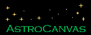
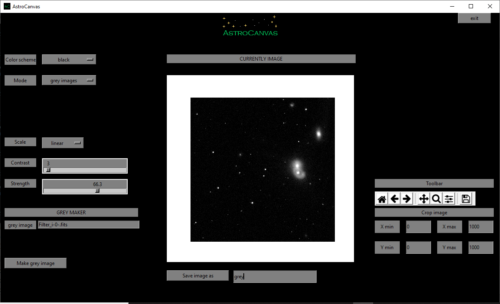

# AstroCanvas

Application designed for the calibration of astronomical images and scientific analysis through a graphical interface.

It includes basic calibration operations like Bias, darks and Flats corrections and reduction. In addition it includes some modes to perform scientific plots, e.g. RGB images or lightcurves.

The Astrocanvas app is in development. Therefore currently is only available the scripst version.

Astrocanvas has been made with the following Python packages:

Matplotlib: *[https://matplotlib.org/][1]*
 
Astropy: *[https://www.astropy.org/][2]*

Tkinter: *[https://docs.python.org/3/library/tkinter.html][3]*

[1]: https://matplotlib.org/

[2]: https://www.astropy.org/

[3]: https://docs.python.org/3/library/tkinter.html

see the official documentation at: *[https://readthedocs.org/projects/astrocanvas][4]*

see the official repository at: *[https://github.com/piexpiex/AstroCanvas][5]*

[4]: https://readthedocs.org/projects/astrocanvas/

[5]: https://github.com/piexpiex/AstroCanvas
