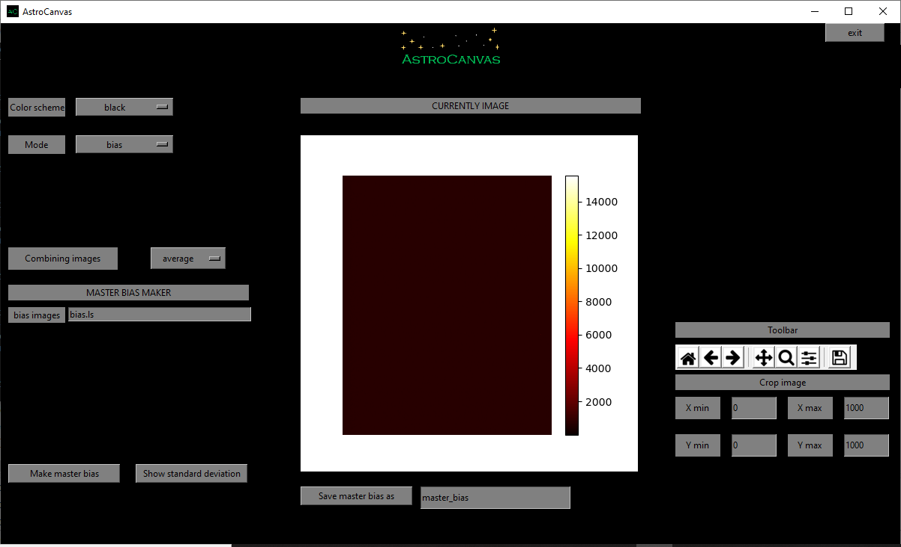

Analysing of images 
*******************

The analysis of images is perfomed in differentes steps:

Identification of all sources in the image with SExtractor and PSFEx.

Rejection of artefacts and saturated objects and selection of good objects.

Crossmatch with the catalog used to the calibration.

Selection of the good fotometry objects and fit the calibration curve.

SExtractor and PSFEx analysis
=============================

A run of SExtractor and PSFEx is executed to obtain the objects in the image, for this, criteria is defined to perform a good identification, also a shape identification of the image is realized to insert an adecuate mask for differents CAFOS CCD detectos.

   ..

   fig. 1 Identification of all sources in the image with SNR >= 5.

Selection criteria
==================

An identification of good objects in neccesary to perform a correct catalog, due to this reason a criteria is defined to exclude bad object and artifacts.

In fig. 2 a criterium based on the relation between the PSF flux and the maximum flux of each source is defined, good objects are shown in a straight line, saturated sources are shown in a maximum of the maximum flux and artifact are shown at the left of the good sources curve. 

.. figure:: figures/fig2.png
   :align: center

   ..

   fig. 2 Red: Saturated sources, blue: artifacts, green: good sources.

Calibration process
===================

After to cross with a calibrated catalog (SDSS DR12 or APASS DR9) a photometric calibration curve is fitted, later the objects magnitudes are calibrated using this curve.

.. figure:: figures/fig3.png
   :align: center

   ..

   fig. 3 Photometric calibration curve. Black: Skymatch sources, blue: objects with morphology criteria, red: objects with good photometry used to fit the calibration curve.

