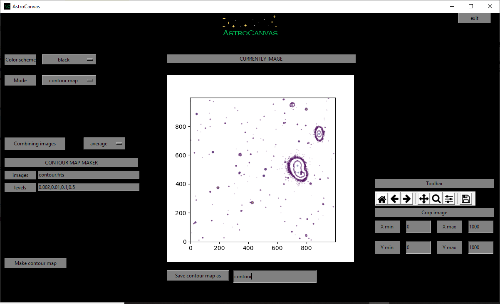

Contour map
***********

Contour maps represent areas with the same intensity, they are usually used to represent bright maps of photometry images.

Creation of contour map
-----------------------

To create a contour map you could use one image or a list of images (same as the bias section) and put Astrocanvas in **contour map** mode. Later write the name of the file in the **images** entry. You can also select an area of the image writing the limits in the **Crop image** entries.

The number of contour levels and their intensity is indicated in the **levels** entry, for this you should write the levels in a range between 0 and 1 and separated by comas.

There is also an option to select the combination of all the images (combining images entry), this can be by the median or the average (pixel by pixel) of the images.

To obtain the contour map, press the **make contour map** button and, after the processing, the contour map appears in the canvas.

   ..

   fig. 10 screenshot of Astrocanvas in contour map mode plotting a contour map from a science image (the lines indicateregions of equal intensity).

The Matplotlib toolbar is available in the right of the window with its basic functions.

In this case, the program only returns the size of the image.

.. code-block:: bash 

   Contour map
   -------------
   size= 1000 X 1000

Finally, you can save the contour map writing a name and clicking on the **Save contour map as** button.