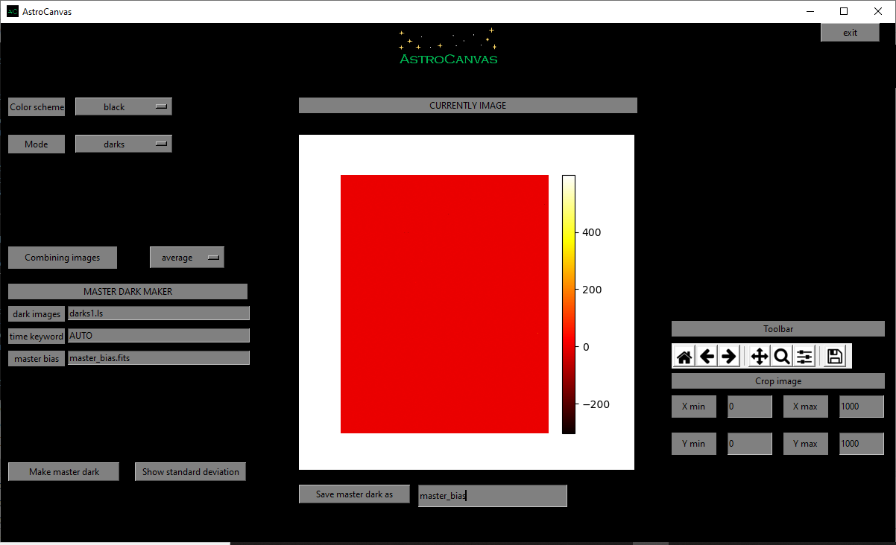

Dark images
***********

These images correspond to the dark current of the CCD, they are stimated by some previous images preventing that any light reaches the telescope, with different exposition times.

Operation files
---------------

The aim of the dark images is to stimate this dark current, for this, the dark images must be combined in only one image and subtract the master bias, called master dark.

For this, you could write a list file with the path of each image (same as the bias section) and indicate the keyword of the fits heads which has the information of the exposure time, writing the name of this keyword in the **time keyword** entry.

.. code-block:: text

   darks/dark_1.fits  
   darks/dark_2.fits
   darks/dark_3.fits

However, you could indicate the times manually, writing **AUTO** in the **time keyword** entry and writing the times in the list file, as the following example.

.. code-block:: text

   darks/dark_1.fits  1
   darks/dark_2.fits  2
   darks/dark_3.fits  5

Dark estimation
---------------

To estimate the master dark put AstroCanvas in **dark** mode and write the name of the list file in the **dark images** entry. You can also select an area of the image writing the limits in the **Crop image** entries.

The master bias is indicated in the **master bias** entry, you can write the name of a fits file (you should ensure that it has the same size as dark images) or a number. 

There is also an option to select the combination of all the images (combining images entry), this can be by the median or the average (pixel by pixel) of the images.

To obtain the master dark, press the **make master dark** button and, after the processing, the master dark appears in the canvas.

   ..

   fig. 2 screenshot of Astrocanvas in darks mode plotting a master dark image.

In addition, a image with the standard deviation could be shown in the canvas with the **show standard deviation** button.

The Matplotlib toolbar is available in the right of the window with its basic functions.

When you make a dark image, the terminal shows some information, the average, the standard deviation, the maximun value and the minimun value of the master dark pixels and also its size, an example is shown below. 

.. code-block:: bash 

   Dark image
   ------------
   average= ( -0.0329138592 )
   standard deviation= ( 1.862602852243215 )
   max= ( 599.4870000000004 )
   min= ( -302.4710000000001 )
   size= 1000 X 1000

Finally, you can save the master dark writing a name and clicking on the **Save master dark as** button.