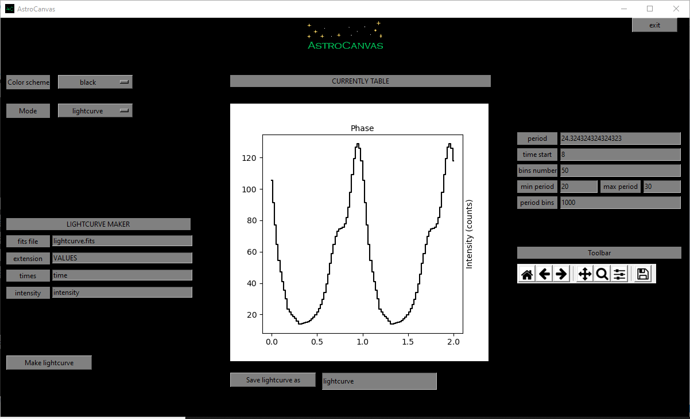

Lightcurve
**********

Lightcurves are representations of the flux variation during a period of time, tipically they represent periodic flux variations of punctual sources and are represented with two cycles of this variation by stimating the average of the entire periods of the lightcurve.

Operation files
---------------

The lightcurves are obtained from fits tables where one column has to contain the time and could be another which contains the intensity at each time. 

First write the name of the fits image in the **fits file** entry and the extension of the fits file where are contained the table in the **extension** entry.

Creation of lightcurve images
-----------------------------

To estimate the periodic lightcurve put AstroCanvas in **lightcurve** and write the name of the file and the respective extension.

To obtain the lightcurve, fill the following parameters and the right of the window.

- **period**: The obtained period of the flux variation.

- **time start**: The starting time of the observation (move the obtained curve along the phase axis, its predefined value is 0).

- **bins number**: The number of bins in the phase axis (its predefined value is 50).

- **min period**: The minimum value for the period search.

- **max period**: The maximum value for the period search.

- **period bins**: The number of period between **min period** and **max period** for the period search.

.. important::
  If you do not fill the period value, it will be searched with the **min period**, **max period** and **period bins** values. In case yo do not fill them, the period will be 1.11 (arbitrary units).

Then press the **make lightcurve** button and, after the processing, the lightcurve appears in the canvas.

   ..

   fig. 11 screenshot of Astrocanvas in lightcurve mode plotting the average profile of a simulated lightcurve maked with some lorentz curves.

The Matplotlib toolbar is available in the right of the window with its basic functions.

In this case, the program only returns the period of the image.

.. code-block:: bash 

   Lightcurve
   ----------
   period= ( 24.324324324324323 )

Finally, you can save the lightcurve in a table writing a name and clicking on the **Save lightcurve as** button.