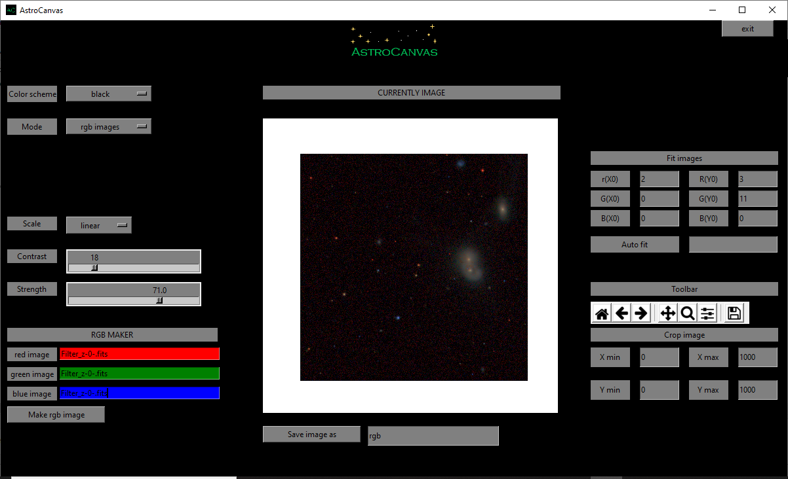

RGB image
*********

These images represent the combination of different photometry images painted with different artificial colours. Normally they are three different images and the corresponded colours are red, green and blue. Furthermore, these images are normalized to produce a more colourful image.

Operation files
---------------

The aim of these images is to study structures and positions of photometric images. However, they are usually used to produce beautiful astronomical images.

To create a RGB image is not neccessary to create any list, only put AstroCanvas in **rgb images** mode and write the name of the red, green and blue images in the **red image**, **green image** and **blue image** entries respectively. You can also select an area of the image writing the limits in the **Crop image** entries.

Creation of RGB images
----------------------

The images are normalized from 0 to 1 and mixed, you could select the contrast and the intensity moving their respective scalebars. In addition, you could select the scale of the image between linear and logaritmic.

To obtain the RGB image, press the **make rgb image** button and, after the processing, the RGB image appears in the canvas.

   ..

   fig. 8 screenshot of Astrocanvas in rgb images mode plotting a rgb image from three different science images.

When you make a RGB image, the terminal shows some information, the average, the standard deviation, the maximun value and the minimun value of the image pixels and also its size, an example is shown below. 

.. code-block:: bash  

   RGB image
   -----------
   average= ( 5.614121666666667 )
   standard deviation= ( 13.798506828263765 )
   max= ( 244.33333333333334 )
   min= ( 0.0 )
   size= 1000 X 1000

Fit images and auto fit
-----------------------

You could perform a manual fit, writing the number of pixels you like to move each image in each direction (you could write negative numbers), the images will be moved at the next time you click the **Make rgb image** button. 

.. important::
  It is necessaty to fill all the entries. Therefore, you should write 0 in the entries that you do not like to fill.

There is also available an option to perform an automatic fit of the position of each image, for this, you should write **yes** in the **Auto fit** entry.

Finally, you can save the RGB image writing a name and clicking on the **Save image as** button (the image will be saved in png format).