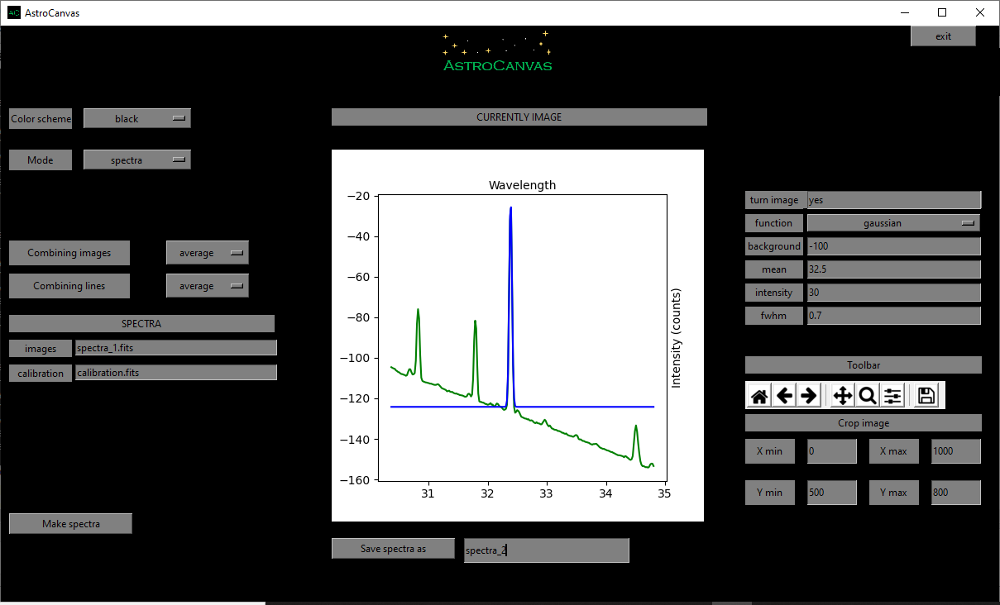

Spectra
*******

Spectra images tipically represent the spectrum of the source in a direccion (due to the fact that they tend to be taken with a slit), they tend to be used to study, for example, the composition, variation of the velocity or the distance to the source.

Operation files
---------------

In order to avoid cosmic ray effects is recommended to use more than one spectra image.

For this, you could write a list file with the path of each image (same as the bias section) and put Astrocanvas in **spectra** mode.

.. code-block:: text

   spectra/spectra_1.fits  
   spectra/spectra_2.fits
   spectra/spectra_2.fits

spectra estimation
------------------

To estimate the spectra put AstroCanvas in **spectra** mode and write the name of the list file in the **images** entry. You can also select an area of the image writing the limits in the **Crop image** entries.

There are options to select the combination method for the different images (combining images entry) and for the pixels in the spectrometer dicrection (combining lines entry). If the lines were combining in the wrong direction, you should write **yes** in the **turn image** entry.

The pixel-wavelength relationship previously stimated with the spectral arcs is indicated writing the name of the fits file in the **calibration** entry.

To obtain the master flat, press the **make spectra** button and, after the processing, the spectra appears in the canvas.

Fit lines
---------

To fit spectral lines is necessary to write all the following parameters. In addition, you can chose the function (gaussian, voigt or lorentz):

- **Background**: The intensity of the background at the spectral line position.

- **Mean**: The mean value in pixels of the spectral line.

- **Intensity**: The intensity of the spectral line without the background

- **Fwhm**: The fwhm of the line in pixels.

- **Wavelength**: The correspondent wavelength of the line (the units would be arbitraty).

.. important::
  The fit is only for the line pixel, it should not fit the closest background.

Later, the program will fit the line and return the fitted parameters, to obtain the spectra and the fitted line press the **Make spectra** button.

.. code-block:: console

  spectral line
  -------------
  Type gaussian
  Intensity = ( 103.2280987915865 )
  Fwhm = ( 0.0549086977085471 )
  central pixel = ( 32.387367223906764 )
  Background =( -124.10445350960393 )

   ..

   fig. 7 screenshot of Astrocanvas in spectral arcs mode plotting the obtained pixel-to-wavelength calibration curve (error bars related to the fwhm of each line).

Finally, you can save the sprectra writing a name and clicking on the **Save spectra as** button.