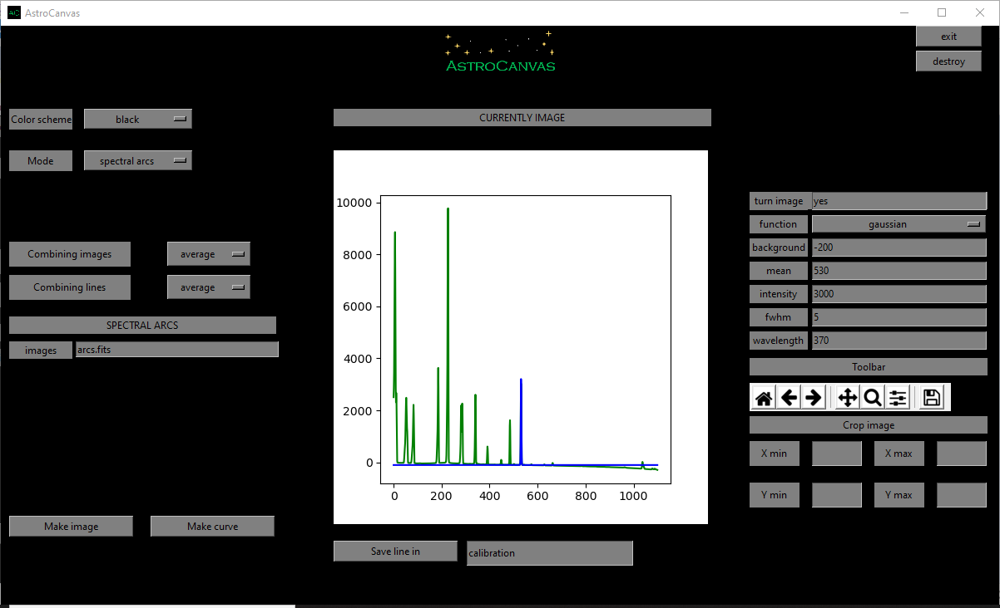
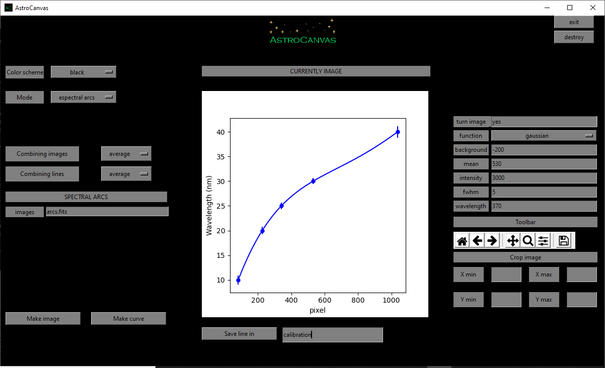

Spectral arcs
*************

These images are used to stimate the relation between pixel and wavelength in the spectrometer direction. They are images of chemycal element lamps with pre-calibrated spectral lines, these lines should be identified in the spectra and used to find stimate the pixel-wavelength relationship with a simple polinomic.

Operation files
---------------

The aim of the spectral arc images is to stimate this relationship, for this, the arc images must be combined in only one image and subtract the master bias, master dark and master flat with the image reduction mode and later find out their lines in the spectral arcs mode.

For this, you could write a list file with the path of each image (same as the bias section) and put Astrocanvas in **spectral arcs** mode.

.. code-block:: text

   arcs/arcs_1.fits  
   arcs/arcs_2.fits
   arcs/arcs_3.fits

arcs estimation
---------------

To estimate the arcs spectra put AstroCanvas in **spectral arcs** mode and write the name of the list file in the **images** entry. You can also select an area of the image writing the limits in the **Crop image** entries.

There are options to select the combination method for the different images (combining images entry) and for the pixels in the spectrometer dicrection (combining lines entry). If the lines were combining in the wrong direction, you should write **yes** in the **turn image** entry.

To obtain the master flat, press the **make spectra** button and, after the processing, the spectra appears in the canvas.

Fit lines
---------

To fit spectral lines is necessary to write all the following parameters. In addition, you can chose the function (gaussian, voigt or lorentz):

- **Background**: The intensity of the background at the spectral line position.

- **Mean**: The mean value in pixels of the spectral line.

- **Intensity**: The intensity of the spectral line without the background.

- **Fwhm**: The fwhm of the line in pixels.

- **Wavelength**: The correspondent wavelength of the line (the units would be arbitraty).

.. important::
  The fit is only for the line pixel, it should not fit the closest background.

Later, the program will fit the line and return the fitted parameters, to obtain the arcs spectra and the fitted line press again the **Make spectra** button.

.. code-block:: console

  spectral line
  -------------
  Type gaussian
  Intensity = ( 3344.032020155799 )
  Fwhm = ( 3.0083512390015934 )
  central pixel = ( 531.1836393309338 )
  Background =( -104.95762674276651 )
  wavelength =( 27.0 )

   ..

   fig. 5 screenshot of Astrocanvas in spectral arcs mode plotting the spectra of the arcs images (green) and the gaussian fit of one spectral line (blue).

Calibration curve
-----------------

To obtain the calibrated pixel-wavelength curve is necessary to fit some lines and press the **save line in** for each line, the fits will be saved in a fits table with the indicated name.

.. important::
  The lines cannot be removed from this calibration fits table. Therefore, be careful saving the lines or you should start again if you wrote a wrong line.

When you have enough fitted lines you could print the calibration curve with the **Make curve** button.

   ..

   fig. 6 screenshot of Astrocanvas in spectral arcs mode plotting the obtained pixel-to-wavelength calibration curve (error bars related to the fwhm of each line).

