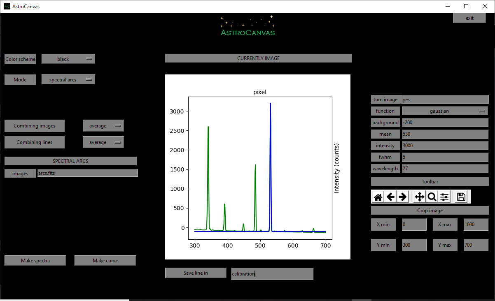

Spectral arcs
*************

   ..

   fig. 5 screenshot of Astrocanvas in spectral arcs mode plotting the spectra of the arcs images (green) and the gaussian fit of one spectral line (blue).

.. figure:: figures/fig6.png
   :align: center

   ..

   fig. 6 screenshot of Astrocanvas in spectral arcs mode plotting the obtained pixel-to-wavelength calibration curve (error bars related to the fwhm of each line).